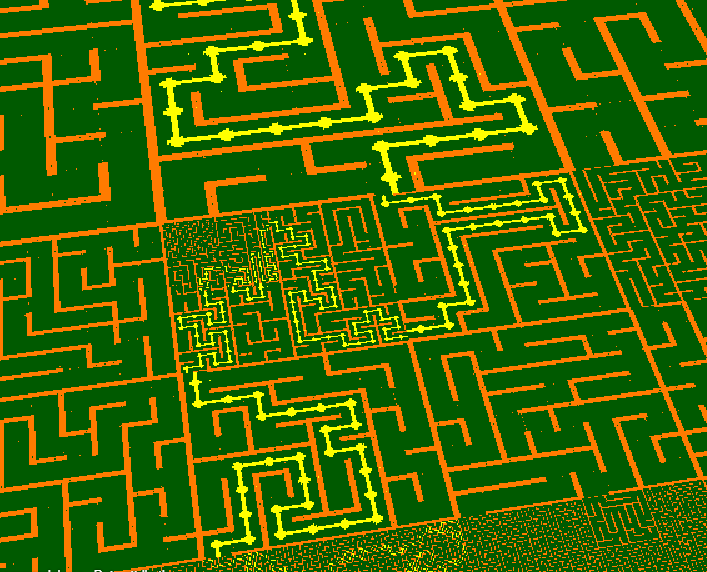
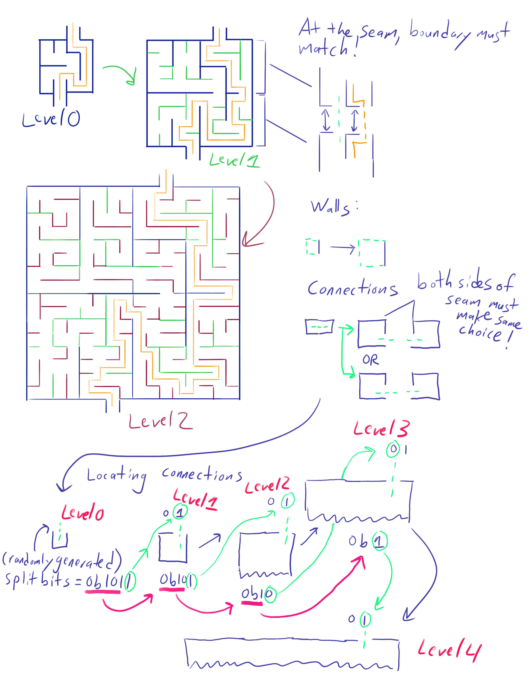

# Nested Mazes (2022)

This project generates a 3D Tiles tileset to recursively generate mazes in the gaps of the parent maze. It has
the interesting property that it always produces a valid
maze solution even while loading.

| While loading | Fully loaded |
|--|--|
| |  | 

## Full Disclosure

I work at Cesium, and have worked on some of the features I use in this project,
the 3D Tiles Next extensions for glTF (`EXT_mesh_features`) and 3D Tiles 1.1
(implicit tiling).

## Usage

To generate the tileset, simply do

```
cargo run
```

I didn't feel like making a command line interface for this yet
Check `main.rs` if you want to change the depth of the generated tileset.
If you want to change the grid size, see `GRID_SIZE` in `grid_coords.rs`. This
must be a power of 2 to work correctly.

To view the results, serve the `output/` directory with a 
static server. I use the npm package `http-server` to do this:

```bash
# -p is the port number
# --cors is important if using the Sandcastle below
# -c-1 disables the cache. Helpful if you generate the maze
# multiple times.
http-server -p 8080 --cors -c-1
```

Right now I don't have a viewer, so you can use 
[this CesiumJS Sandcastle](https://sandcastle.cesium.com/#c=1Vdtb+I4EP4rFp/CbjaBdru3oi+6CugJCWhV6Op0QsqaxIBvHTuyHfpy6n+/cewQU6j27ttdP5DYmeeZZ8YztpsKrjTaUvJIJLpEnDyiPlG0zKNv1VywaKXVuC+4xpQTuWi1zxd8wdMKmRKuK6RD9bHU8Ib5abSSIh+QtSREBZ9+OQvR506Iuh2DttglXa997ARrSZ8+V8AHTldC5rMUMxJ0Ox6K8LKBzCXmyhiqiGClp0LqzUMxFzf0iWQ3EucksAp9zbnICLPODp3nJdO0YM8B+AmdxNDPizMM2j6lpowoooHOpjJS4JZEhaQ51XRLVISzLPBY7ON0MLfA4K8FR6iUrIcWrY3WRS+OmYDgN0Lp3tfO106c4xcSOz/Rn0rwRSs0IMLxkpGJiWn4VBDwCAFjINKyJJWFFy+MXw+E57iYbXD2tgD6pdIit1+cPrsoqoeqIUwkj5ixZoyQfi5Ir2ZwiziHuWh2PbkbD++Tk0FY224xK8HYczknT7qUxOGCHeu/SI1VFBV87fJj/3K8BlKaYk0Fv6EMSqL3xuvk0CSaDq/vh7O5T0R/ykPfo6lZXtuO8DWs8wirwUlqIP+tbHq6/lc5tb+Mrjea8nXVHTvOsT8bPUzHIytmJfHaNI8teeO5h76bD1uSnqA1ZMN1S1JuVbBiAtv+SWgWWpuUMAYf2/UK2h6zlvPReJj0bx+mc2iz7peoc+7bVHBjMrm+SwajyXA6G91OZ2ZDgS/ByRkAwgrWfh93N/p9OE5moz+GxkXUQfERSgc/IHn4lvSH4/ER55apaxVYARYdx0iVSy1xqhFGG8xW8Chg62VIcERwukGKZuTA1Wg6G86PeDsi4dOR4Hz/pSJIbwhq6rRaEjQaIC2QIoxU2szChAjzzBhzJFYrs1svn/dE70gBibeCZoDHOYITja4gRGW/VxGU28RxuBy5OnAZt+scog5kC32Exxn68JNAJriwgYBSSITRoG3tw8jz7CahysB1I+NjXXvg6Gh63bJLAmjusVTzr1ZIFXPdBRM47YMbNxjxooRCVtUzRJQLGKYveVKfLXDuYAY7gn3ZNUAlWUi6phwzq9mRRFjDgbQs4bYQgZq+EDJL9nvC9s1v96PBrqabtvH7zbCaIgx8Tx8aZFOxlrIpFrNkl3Y2qIWtCDa5GWUq8na/uu0sgxKs/Af42kw1CqzuRkCl/u3esicw3G0rfug7BUcJPH0HcD8Oc1gmOVY/gMPVxMkgcMd6uK+zHcm9HBRYb45hvaSFvkyL34VwamiEBHMmpG2j06Bj9phO1LWtc+4ZV0r3bLvW9uTQtlJ2aOsAnfa+jNrQk7MrQ/slp09B9R56MsImee337RspYZOwRkDdMFFGVyuzl12iRsCr+flubmyVfX33S717mUm9f4OrDN0V9EWIfC4CB2uft8LWhdLPjFzVZ+avNC/gxmyuA0EUxZrkBQNBKl6W6Q/jSe3K/iL2oRcZ3SKaXR755wClDCsFX1YlYzP6Qhatq4sY7A+gUEQZnMK3WyIZfjZmm+7V2E5GUXQRw/A4UgvBlli+Yf4b) to visualize the results.

## How it works



Imagine generating a maze on a square grid. Now, zoom
in two times. The hallways which used to be 1 cell wide
are now 2 cells wide. This is enough space to generate
another maze within! This process can be repeated
an abitrary number of times as desired (though the number
of cells grows exponentially).

That's really all there is to this conceptually. I use
depth-first search both for connecting cells into a maze
and solving the maze. However, I wanted to be able to render
large mazes, so I realized a quadtree structure (with the help of 3D Tiles) would work nicely here.

### Quadtree mazes

If the parent tile has `n x n`, the next maze will have size
`2n x 2n`. However, instead of making a maze this large, I
split it into 4 `n x n` tiles instead, so every tile has the
same size. Each tile can be processed separately (potentially
in parallel!) as long as the seams between tiles produce the
same results.

When scaling up the maze, I have two rules about how to
handle walls and connections between tiles across seams

1. **Walls** - A 1-cell wide wall in the parent tile becomes a
2-cell wide wall in the child tile
2. **Connections** (at seams only) - To avoid loops in the
maze, A 1-cell wide connection in the parent tile becomes a
1-cell wide connection with a wall next to it. The choice of
which of the 2 child cells has the connection is arbitrary,
but both sides of the seam _must_ make the same choice. I
handle this with "split bits" (see the next section). This
rule only is applied at seams between tiles, otherwise the
interior of the tile would be too constrained.

See the right side of the infographic to see how this works

### Split Bits

To make sure the connection rule is applied consistently on
both sides of the seam no matter how many times the tile is
subdivided, I found a simple way to encode the connections so
only 1 unsigned integer per connection at the seam is needed.
The key thing is encoding where the connection is at arbitrary
levels of depth in the tree. Since at every level of
subdivision there are two choices of where to put the connection, a single bit is all that's needed per level. So
an integer containing bit flags is sufficient. I called these
"split bits"

Whenever a new connection is found at a seam, I
generate a random unsigned integer to encode the split bits.
At every level of subdivision, I strip off the right-most bit
and use it to determine where to put the connection:

* For horizontal walls, 0 means left child, 1 means right child
* For vertical walls, 0 means bottom child, 1 means top child

See the bottom part of the infographic to see how this works

### Metadata

I make use of Feature ID Textures from the `EXT_mesh_features`
specification to encode the maze data. For each cell, all I
need to encode is it's connectivity information. This can
be simple as a set of bit flags saying which of the 4
directions (right, up, left, down) are connected to adjacent
tiles. There are $2^4=16$ possibilities, so this can be
encoded directly as a `u8`. For the solution of the maze,
I just need a second set of connection info. This is encoded
as a second channel in the feature ID texture (red=basic connectivity, green=solution connectivity)

When rendering, I can use these connection IDs to index into
a texture atlas with 16 tiles to determine what to render.
This is the same technique used in classic video games for
rendering sprites and tilemaps.

Only 2 texture atlases are needed: 1 for walls, one for the
solution path. The shader can handle the rest. 

In my initial test, I used B&W images, and let the shader
add the coloring for walls and tiles. However, it would also
be easy to make pixel art tiles as well.

### Compact storage

There is a lot of symmetry in this maze structure so many
details can be shared across tiles:

* The geometry of each tile is always a 2-triangle quad, as
    the shader does the heavy lifting. I generate a single
    glTF `.bin` file that is referenced by every tile content
* Since the grid is dense, the implicit tiling details are
    constant (all tiles and contents are available, no child subtrees) so a static subtree file is copied into the
    output directory
* The texture atlases are the same for every tile, so those
    are also static images copied into the tileset directory

In fact the only details that aren't the same between tiles:

* The feature ID textures used to encode the maze data. There
    is one texture per tile
* The transform matrix used to position each tile.

## Bibliography

Most of what I know about maze generation comes from the
book [_Mazes for Programmers_](https://pragprog.com/titles/jbmaze/mazes-for-programmers/) by Jamis Buck, though I
haven't looked at the book in a year or two. The key insights
from this are that:

* Mazes are simply spanning trees on a graph
* There are many algorithms to generate them with different
    properties, depth-first search is one of the ones I found
    most straightforward.