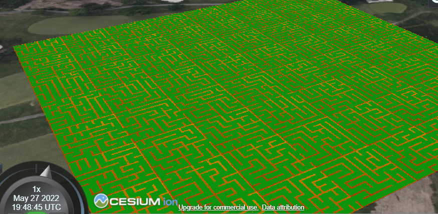

# Nested Mazes

## 2022-05-20 Initial DFS Maze Generation

So far I have a basic grid and a `DFSMaze` class to connect cells together
into a maze.

Next steps:

* Compute the solution path
* Generate a glTF with the results as a feature ID texture 
  (via `EXT_mesh_features`)

## 2022-05-23 Productive Weekend

This weekend and this morning I got a few more parts
of this done:

* Generated a PNG image for the feature ID texture. I manually made a glTF for 
  testing
* Tried making a shader to visualize the results. It's working, though I'm 
  getting seam artifacts. I need to learn more about texture atlasing
* Subdivided a parent tile into 4 children and propagated walls and boundary
  conditions. not 100% tested, but I need tileset output to see for sure. I
  also need to make a method to recursively subdivide until a given level.
* Started working on glTF output. I have a function to generate the geometry
  buffer, the next step is generating the GLB files. I started working on the
  JSON part but still have to compute the buffer offsets and such.

Next steps:

* Generate GLB files
* Generate an implicit tileset JSON
* Generate solution path
* Make a viewer in CesiumJS

# 2022-05-25 Getting Closer

Yesterday and today, I've been chipping away at the tileset
generation. Now I have a `Tileset` class which copies static
files to the output directory and does a DFS to generate
the `Tiles`. The JSON for the GLB file is nearly complete,
but then I still need to generate the GLB binary file.
Shouldn't be too long before I have something I can render
in CesiumJS.

Next Steps:

* Figure out correct matrix translations for GLB files
* Finish generating GLB files and tileset
* Make a CesiumJS viewer
* Figure out how to generate the solution paths

# 2022-05-26 GLB output

Today I at least got the program outputing (nearly) valid GLBs. The main thing
left is to finish computing the matrix for each tile. Then I need to try it
in CesiumJS and see if there's anything semantically wrong with the output.

Next Steps:

* Figure out correct matrix translations
* Generate solution paths
* Make a CesiumJS viewer

# 2022-05-27 Tileset Output

Today I successfully got a maze rendering in CesiumJS!

See [This Sandcastle](https://sandcastle.cesium.com/#c=lVZtb9s2EP4rhL9MblXJTtJ1zUuxznYKA3ES1E4wDAZUWjrZXClSICnHydD/vqNIO0zsFZg/WCJ5z3OvvFMuhTZkzeABFLkgAh7IADRrquS+3YvmnbxdD6QwlAlQ8073bC7mIm+ROQjTIj1qQJXBNyqOk1LJaghLBaCjdx/ex+SkF5N+z6IddsGWyxA7oUaxzUkLvBOslKqa5pRD1O8FKBDNM2SmqNBWUCdAtbmWyqzu6pm8ZBsoLhWtIHIWhjZXsgDulO0rrxpuWM0fI9QTexPjMC5eMOqGlIZx0GCQzoUy0agWklqxihm2Bp3QoogCFvc4Hs4cMPpnLghpFD8l887KmPo0TblE51dSm9OTjx8+phV9gtTrSf7WUsw7sQWBoAsOE+vTaFMDakSHKRIZ1UArEfjbrtO0gEWznK7kwx+yEQUTy3vJmwoCTCDzBWQFCM5HSkm1k/mxF4CK1tMVLV4X0qDRRlbuxPvpkqtPSbvEjeyBcv68JsQ81miOZ/DFMMO9ZPp5cns1+podDeOt7JryBoUDlTPYmEaBx0U71v8RYmdRUoulj7P9/ej61x/t0/2Xii5tzJ2HVvUp+WYP1pIVu9MJXp7o0i/Gom4MKXX7jAkTEpf5U5VtU4VppJxU/qW7jUvJJUVBKQTkhkmRoYILtxt5tqQEan0fFzp5FtQ2V22sID8iUrElE5RnzdrCPZAaTPKiweubGNgMpFRF1vMwl2Sn/svX8TCbjv8aIfa3pBcS58C3pIrmJgoVvXkGusJ5zTsbX42ywc3d9Qzx/V+Tl7pbfisy+XybDceT0fV0fHM9tTcOT6Kj9wiIW1j3v3G34z9HV1vb+0mPpAcoPXyP5O4+G4yurg4od0x9Z4EzwKHTlOhmYWwsCCUrykt81NibOJGCAM1XRLMC9lSNr6ej2QFtB0x4d8C5UH+jgZgVBEXT3lUyHhIjiQYOrW02czGhorDCgsiytO1s8fjC6B0pImlb3RpoRbDlsxJd1EElNOvMc/gYvSzaNMh2THoYM/IWH++xSn7uzoTWzh20F8NhLTHusuMq0O83XTE+G/N2V6JvDgf5LLxotgVkFdXfkcMTHg0j36ziQEc3UTsjUf2xxUuV5ZJL5QJwHPVsdfSSI+fuWSDcqnkh2z8k6/63PSEpWFna5F6Qim2iQGEcEMbPPmxpdgS6hrzhVHmGrZEn3Z8Q7PJwLUmOXZc8rDBO418qUkgcI2QFCnBqYjdjOGfpd9BtttqAEb3C74cdg7UfpYXhjyhDRSvYuhGERmD7xkZ44V/YEzg7g8birtyedw4wGnjv9vZjT7nnYNvY7d83O+Pare3UzYNJZksinHmtoB/+T1JWMxl5WPesE3fOtXnk8Gk7SH5nVY3fKnYcRUmSGqhqjhbqdNHk360mvevY52kIPS/YmrDi4sBnGSaEao0nZcP5FEM173w6T1F+D4rFbYf+zRoUp49WbNX/dOU2kyQ5T3F5GGmk5AuqXjH/Cw)
It requires a static server to host the maze.

Still not sure if I have the geometric error calculation correct, but at least
it renders.