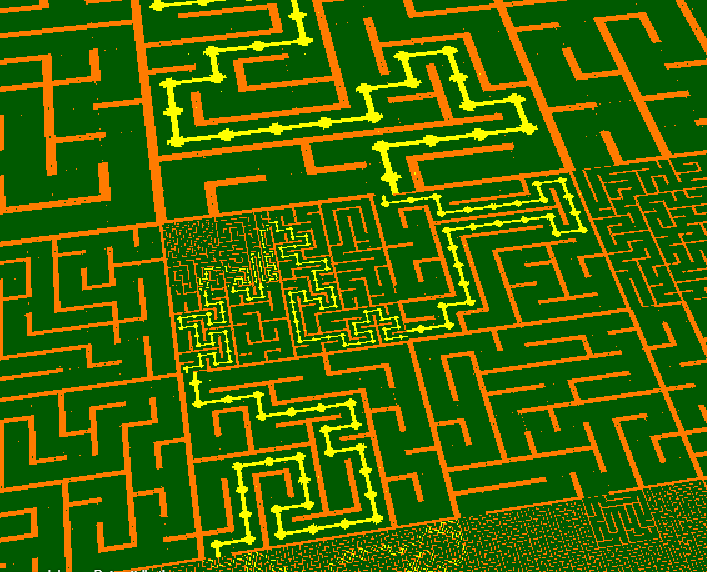
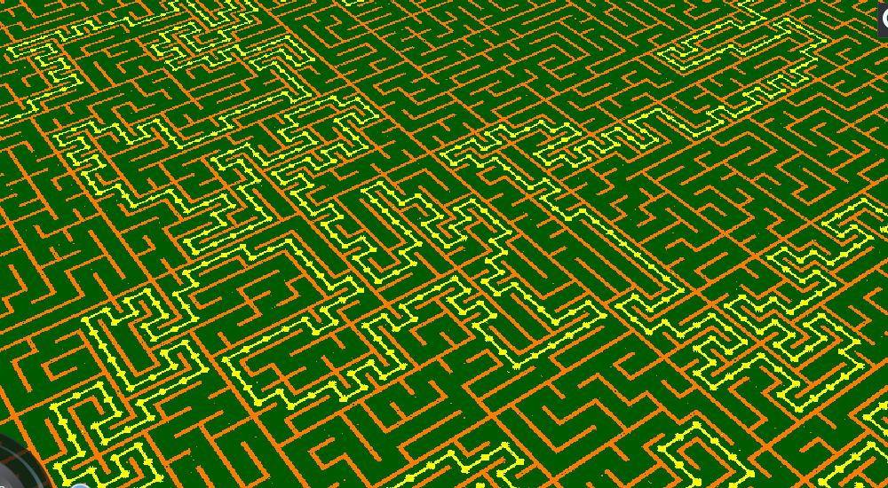

# Nested Mazes

## 2022-05-20 Initial DFS Maze Generation

So far I have a basic grid and a `DFSMaze` class to connect cells together
into a maze.

Next steps:

* Compute the solution path
* Generate a glTF with the results as a feature ID texture 
  (via `EXT_mesh_features`)

## 2022-05-23 Productive Weekend

This weekend and this morning I got a few more parts
of this done:

* Generated a PNG image for the feature ID texture. I manually made a glTF for 
  testing
* Tried making a shader to visualize the results. It's working, though I'm 
  getting seam artifacts. I need to learn more about texture atlasing
* Subdivided a parent tile into 4 children and propagated walls and boundary
  conditions. not 100% tested, but I need tileset output to see for sure. I
  also need to make a method to recursively subdivide until a given level.
* Started working on glTF output. I have a function to generate the geometry
  buffer, the next step is generating the GLB files. I started working on the
  JSON part but still have to compute the buffer offsets and such.

Next steps:

* Generate GLB files
* Generate an implicit tileset JSON
* Generate solution path
* Make a viewer in CesiumJS

# 2022-05-25 Getting Closer

Yesterday and today, I've been chipping away at the tileset
generation. Now I have a `Tileset` class which copies static
files to the output directory and does a DFS to generate
the `Tiles`. The JSON for the GLB file is nearly complete,
but then I still need to generate the GLB binary file.
Shouldn't be too long before I have something I can render
in CesiumJS.

Next Steps:

* Figure out correct matrix translations for GLB files
* Finish generating GLB files and tileset
* Make a CesiumJS viewer
* Figure out how to generate the solution paths

# 2022-05-26 GLB output

Today I at least got the program outputing (nearly) valid GLBs. The main thing
left is to finish computing the matrix for each tile. Then I need to try it
in CesiumJS and see if there's anything semantically wrong with the output.

Next Steps:

* Figure out correct matrix translations
* Generate solution paths
* Make a CesiumJS viewer

# 2022-05-27 Tileset Output

Today I successfully got a maze rendering in CesiumJS!

See [This Sandcastle](https://sandcastle.cesium.com/#c=lVZtb9s2EP4rhL9MblXJTtJ1zUuxznYKA3ES1E4wDAZUWjrZXClSICnHydD/vqNIO0zsFZg/WCJ5z3OvvFMuhTZkzeABFLkgAh7IADRrquS+3YvmnbxdD6QwlAlQ8073bC7mIm+ROQjTIj1qQJXBNyqOk1LJaghLBaCjdx/ex+SkF5N+z6IddsGWyxA7oUaxzUkLvBOslKqa5pRD1O8FKBDNM2SmqNBWUCdAtbmWyqzu6pm8ZBsoLhWtIHIWhjZXsgDulO0rrxpuWM0fI9QTexPjMC5eMOqGlIZx0GCQzoUy0agWklqxihm2Bp3QoogCFvc4Hs4cMPpnLghpFD8l887KmPo0TblE51dSm9OTjx8+phV9gtTrSf7WUsw7sQWBoAsOE+vTaFMDakSHKRIZ1UArEfjbrtO0gEWznK7kwx+yEQUTy3vJmwoCTCDzBWQFCM5HSkm1k/mxF4CK1tMVLV4X0qDRRlbuxPvpkqtPSbvEjeyBcv68JsQ81miOZ/DFMMO9ZPp5cns1+podDeOt7JryBoUDlTPYmEaBx0U71v8RYmdRUoulj7P9/ej61x/t0/2Xii5tzJ2HVvUp+WYP1pIVu9MJXp7o0i/Gom4MKXX7jAkTEpf5U5VtU4VppJxU/qW7jUvJJUVBKQTkhkmRoYILtxt5tqQEan0fFzp5FtQ2V22sID8iUrElE5RnzdrCPZAaTPKiweubGNgMpFRF1vMwl2Sn/svX8TCbjv8aIfa3pBcS58C3pIrmJgoVvXkGusJ5zTsbX42ywc3d9Qzx/V+Tl7pbfisy+XybDceT0fV0fHM9tTcOT6Kj9wiIW1j3v3G34z9HV1vb+0mPpAcoPXyP5O4+G4yurg4od0x9Z4EzwKHTlOhmYWwsCCUrykt81NibOJGCAM1XRLMC9lSNr6ej2QFtB0x4d8C5UH+jgZgVBEXT3lUyHhIjiQYOrW02czGhorDCgsiytO1s8fjC6B0pImlb3RpoRbDlsxJd1EElNOvMc/gYvSzaNMh2THoYM/IWH++xSn7uzoTWzh20F8NhLTHusuMq0O83XTE+G/N2V6JvDgf5LLxotgVkFdXfkcMTHg0j36ziQEc3UTsjUf2xxUuV5ZJL5QJwHPVsdfSSI+fuWSDcqnkh2z8k6/63PSEpWFna5F6Qim2iQGEcEMbPPmxpdgS6hrzhVHmGrZEn3Z8Q7PJwLUmOXZc8rDBO418qUkgcI2QFCnBqYjdjOGfpd9BtttqAEb3C74cdg7UfpYXhjyhDRSvYuhGERmD7xkZ44V/YEzg7g8birtyedw4wGnjv9vZjT7nnYNvY7d83O+Pare3UzYNJZksinHmtoB/+T1JWMxl5WPesE3fOtXnk8Gk7SH5nVY3fKnYcRUmSGqhqjhbqdNHk360mvevY52kIPS/YmrDi4sBnGSaEao0nZcP5FEM173w6T1F+D4rFbYf+zRoUp49WbNX/dOU2kyQ5T3F5GGmk5AuqXjH/Cw)
It requires a static server to host the maze.

Still not sure if I have the geometric error calculation correct, but at least
it renders.

# 2022-05-28 Maze Solver

Today I implemented a DFS maze solver that works even for the subdivided tiles.
The results look really cool! You always get a valid maze, even while loading
more detail. See [This updated Sandcastle](https://sandcastle.cesium.com/#c=1Vdtb+I4EP4rFp/CbjaBvuze0hddD+gKCWhVaHU6IbEmMeBbx45sh76c+t9vHDvEFKq9+3bXDyR25nnmmfGM7SaCK402lDwSiS4QJ4+oSxQtsuihnAtmjaQcdwXXmHIiZ43m2YzPeFIiE8J1iXSoLpYa3jA/jpZSZD2ykoSo4NOX0xCdtELUbhm0xS7oauVjR1hL+nRSAu85XQqZTRLMSNBueSjCixoylZgrY6gigpUeC6nX9/lUXNMnkl5LnJHAKvQ1ZyIlzDrbd54VTNOcPQfgJ3QSQz8vzjBo+pSaMqKIBjqbykiBWxLlkmZU0w1REU7TwGOxj+Pe1AKDv2YcoUKyDpo11lrnnThmAoJfC6U7J1+/fI0z/EJi5yf6Uwk+a4QGRDheMDIyMfWfcgIeIWAMRFoWpLTw4i3HcZySRbGarMXjb6LgKeWrB8GKjHgYz+YbERkBcNKXUsitzeteAjKcT9Y4fVtI3UJpkdkvLk67uKqDyiFMzB8xY/UYIf2cgxzH4IphCnPR5Gp0O+zfzY96YWW7wawAY8/llDzpQhKHC7as/yLFVlGU85XLs/3L8ApIaYI1FfyaMiitzhuvo32TaNy/uutPpj4R/SkPfY+mYnltOsLXsMojrAYniYH8t7Lp6fpf5dT+Mrpaa2iTssu2nEN/NrofDwdWzFLilWlCW/LGcwd9Nx82JDlCK8iG65Z5sVHBkgls+2dO09DaJIQx+NisVtD2mLWcDob9effmfjyFNmt/jlpnvk0JNyajq9t5bzDqjyeDm/HEbEzwJTg6BUBYwprv424Hv/eH88ngj75xEbVQfIDSwfdI7h/m3f5weMC5ZWpbBVaARccxUsVCS5xohNEasyU8ctjCGRIcEZyskaIp2XM1GE/60wPeDkj4dCA433+hCNJrguo6LZcEDXpIC6QII6U2szAhwjw1xhyJ5dLs+ovnHdFbUkDijaAp4HGG4GSkSwhR2e9lBMVm7jhcjlwduIzbdQ5RC7KFPsLjFH34SSAjnNtAQCkkwmjQtvZh5Hl2k1Bl4LqW8bGqPXB0ML1u2SUBNPdYyvlXK6SMueqCEdwagms3GPC8gEJW5TNElAsYJi/ZvDqj4PzCDHYE+7JtgFKykHRFOWZWsyOJsIazaVHArSMCNV0hZDrf7QnbN9/uBr2qpn/Zdo3fbobU1GDgO/pQA+uCtYx1rZgVu7CzQaVrSbBJzSBVkbf5VV1nGRQcu/8AX5mpWoHVXQso1b/dWnYEhttdxQ99q+AggadvD+7HYc7KeYbVD+BwJXHUC9ypHu7qbEZyJwc51utDWC9poS/T4rchHBsaIcGcCWm76DhomS2mFbVt55x5xqXSHdu2tT3aty2V7ds6QKu5K6My9ORsq9B+yehTUL6HnoywTl7zfftaSlgnrBZQ9UuU0uXSbGUXqBbwan6+mwtbaV9dIRPvWmZS71/gSkN3k30RIpuKwMGaZ42wca70MyOX1ZH5K81yuHib20AQRbEmWc5AkIoXRfLDeFLbsj+Pfeh5SjeIphcH/sdACcNKwZdlwdiEvpBZ4/I8Bvs9KBSRucHebIhk+NmYrduXQzsZRdF5DMPDSC0EW2D5hvlv).

|  |  |
|--|--|
| |  | 

If the solution path winds back and forth across a seam, a subdivided tile may
includ multiple disjoint solution paths. Thus, I start by listing all the
boundary connections that either are an exit or are on the solution path
(these properties are inherited from the parent tile) keeping track of which
ones were visited. I run the DFS multiple times until all the edges are used.

I'll admit I'm starting to lose interest in this project in favor of other
math curiosities, but there are several things that could be improved:

Next Steps:
* Try Rust threads, this algorithm is embarassingly parallel. The stack of
  tiles in `tileset.rs` could easily be turned into a work queue.
  [This blog article](https://poor.dev/posts/what-job-queue/) demonstrates a
  similar concept in Rust. I've never used threads in Rust before so it would
  be a good exercise for me.
* Debug why the shader has seam artifacts. Is it the texture coordinates of
  the feature IDs not having half-pixel offsets? or something else?
* Given the high-frequency detail, the shader suffers from aliasing artifacts
  learn how to anti-alias.
* Make some alternate tilemaps. Try doing something more like pixel art?
* Make a proper CesiumJS viewer page.
* The custom shader should get the tilemap URLs and grid size from the tileset
  metadata, not hard-coded.

### Addendum

Before I stopped for the day, I also went through the code and fixed some
places that were hardcoding 4 or 8 so I can change `GRID_SIZE` to a different
power of 2. I switched it to 16, I think it looks nicer.

## 2022-06-21 License clarification

Today I updated the project with the Apache license and added a notice that
the copyright is owned by Cesium GS due to a clause in my employment contract.

## 2022-07-06 Fixing Textures

Today I finally got around to fixing the two tileset textures, both had
a pixel or to incorrect which was causing artifacts.

I also tried out the mipmap settings that are new in custom shaders in CesiumJS
1.95, but mipmapping blurs things across tile boundaries which results in
noticeable seams... see [this Sandcastle](https://sandcastle.cesium.com/#c=3VZRb+o2FP4rFk/hLjPQ3m1XlFarWjohQW9V6B4mpFw3ccC7jh3ZDqWd+O/32E6IgV5te5vGQ4id7/vOd06O7aRSaIM2jL5QhS6RoC/ohmpWFfh3NxctO6kb30hhCBNULTvdi6VIHS+lwjhezbkhysAdEec4V7K4pStFqY5+/OWnGH3sx2jQb7nPbLUKuTNiFNt+dMQnwXKpinlKOI0G/YBFRdVSFooIbYEaU6LNvVRm/VQu5B3b0uxOkYJG3qHlNwqFzCj3wU6DFxU3rOSvEcSJa4txWJUaGHVDScM41dSAnC8k1hCW4lKxghm2oRqTLIsCFf93frvwxOivpUCoUnyIlp21MeWw1+MSkl9LbYaf+p/6vYK80V4dB/+ppVh2YkuigjxzOrM5jbclhYiQMAEhoyrqEEG+MN6dGC9IOV+T7Pj131TayMI/qf35l6KHyA1hInkhnLdjhMxrSYeNQv0SFzCH59ezh+n4MTm7jRvshvAKwEHIBd2aStGaF+1V/0VpvCNcilVdH/8ryApEWUoMk+KOcWiJ4VHU2SkE34+vH8fzRSjE/laHfU8mmU0eZtcPyXRiJwJRRUtKzBDlhGvaTO+6NWIXN9WGdyZoaoX/WzUPfP0PK++vnK3WhomVW2n7yNNwFj/dTyfecq7Iyi5Ev3ysvyH6Yh9saHqGVlCzeuUl1UZHOZfEr8WEZbHHpJRzeNht3rNfrx65mEzHyXzyxxhW7AD3UQ8Nfsb9Cw907GqTyDyvtySYiGpx9KElx6iP3cbqCwEVFAHvh8YBUJxCwBs0vJ3dSSCkBOUm5RkcEtFdPZiIsgLX2v3HiAkJw/StSJpNCTYswqFJ/M0+W5eEVGzFBHEmLhsRTAzsZM8VHDPY0O2NlCpLmtzDIv32OLndF+moPE1ql9Z1aqIw0oeW6XdKy/KSbZ/bUl762agxlkMnQRdOMo2DBdEU2Ctoyat/wG9gunXgfbcGnPvjRjowGO97KEx97+BdgcDfCT3Mw+6ySUH0V9AwfvWd3Ub1eRAf+uxidVCDkpj1e9ygaHFo0/P3KZxbGakAzqXy7X0eQSfbdh4c9LQDO6cH2IHHnp1inbNTbE3odw9tNMDAzr4N/ZOCbSN3Hwc24rZ43e/jWytxW7DWQLNgcMbyvNIUyK2Bnb18sUe9wzcfDWlwoNvSh0e/A9bfLm9SFgsZ1bTuRSfujLR55fSq2SB/ZUUJn1r2hIgw7hlalBwM6d5zlX61kfS+7Ue9kDrK2Aax7PKdb0qUcqI1PMkrzufsjS47V6Me4E+o0EQZbLmfN1Rx8mph68HV1E9ijEc9GL7PNFLyZ6KOlL8B) for example. might work better
to blur within the tile, not across tile seams. But I don't think I can control
the individual mip levels :/